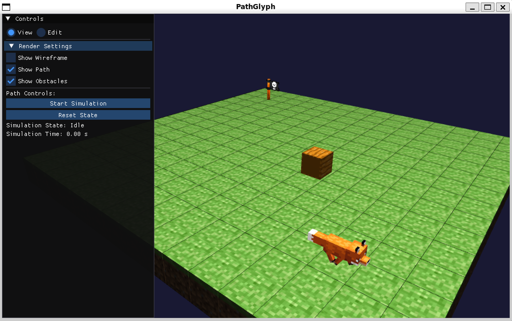

# PathGlyph

PathGlyph 是一个用于可视化路径规划算法（如 A* 和 DWA）的 C++ 项目。
它使用 OpenGL 进行渲染，并提供了一个交互式环境来观察代理在迷宫中寻找路径的过程。



## 主要功能

*   支持多种路径规划算法（目前实现了 A*，DWA 参数有待调整）
*   支持静态和动态障碍物
*   使用 OpenGL 进行 3D 渲染
*   可交互的相机控制（缩放、平移、旋转）
*   可配置的渲染选项（线框模式、显示路径/障碍物等）

## TODO

- 解决各种乱七八糟的 Bug。
- 实现阴影效果。
- 引入 PBR（Physically Based Rendering）渲染管线。
- 添加天空盒。
- 为代理模型添加动画效果
- 实现 TAA
- 继续调整 DWA 算法。

## 构建与运行

### 环境要求

- C++20
- [xmake](https://xmake.io/) 2.7.0 或更高版本

### 构建项目

1. 克隆项目
```
git clone https://github.com/your-username/PathGlyph.git
cd PathGlyph
```

2. 构建项目
```
# 构建调试版本
xmake config -m debug
xmake
```

3. 运行项目
```
# 直接运行
xmake run
```

## 依赖项
- GLAD 
- GLFW
- GLM
- ImGui: `1.92.0 WIP` (包含在 `thirdparty/imgui`)
- TinyGLTF: `v2.9.*` (包含在 `thirdparty/tinygltf`)